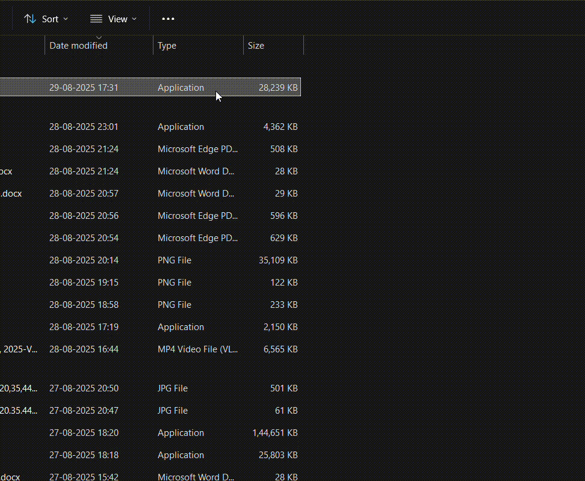

# 🐍 Snake Game 

A fully functional Snake Game built in Python using pygame and collections.deque, showcasing practical applications of Data Structures and Algorithms in game development.

## 🎯 Learning

**collections.deque** – Efficient O(1) operations for snake movement

**Set operations** – Fast collision detection (O(1) lookup)

**Algorithmic thinking**– Time complexity analysis in practice

**Event-driven programming** – Using pygame for input and rendering

## 🕹 How to Play

**Controls:**

Arrow Keys / WASD → Move the snake

R → Restart after Game Over

ESC → Quit the game

Goal: Eat food (red block) to grow and increase your score.

## 🚀 Quick Start
**Option 1:** Run from Source
git clone https://github.com/Mayur-Nagpure/snake-game.git
cd snake-game
pip install -r requirements.txt
python main.py

**Option 2:** Download Executable

Get the latest .exe or .zip from the Releases
 section.

Double-click to play (no Python required).

---

🖥 System Requirements

Windows 10+, macOS 10.14+, or Linux

Python 3.8+ (if running from source)

50MB free disk space

---

🔍 DSA Concepts in Action

**collections.deque** → O(1) append/pop for snake body

**Set** → O(1) collision checks

**Random Sampling** → Efficient food placement

**Event Queue** → Handles user input in real time

---

## 🎥 Gameplay Demo

--

## ✅ Educational project demonstrating practical DSA concepts through game development.